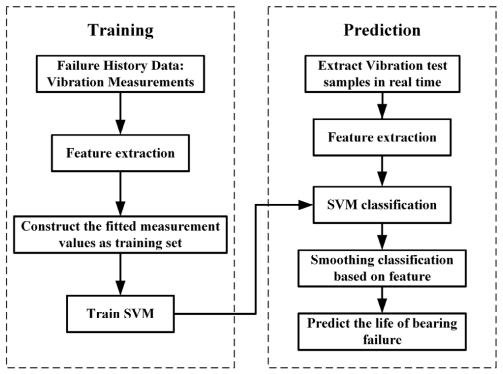

# RUL Prediction

## Bearing remaining useful life prediction using support vector machine and hybrid degradation tracking model

This is a solution to the [IEEE PHM 2012 Prognostic Challenge](https://www.scribd.com/document/427205852/IEEEPHM2012-Challenge-Details-pdf). It focused on the estimation of the **Remaining Useful Life (RUL)** of ball bearings, a critical problem among industrial machines, strongly affecting availability, security and cost effectiveness of mechanical systems.
 

The Dataset was generated using **PRONOSTIA**, An experimental platform for bearings
accelerated degradation tests. We used the dataset available at https://github.com/Lucky-Loek/ieee-phm-2012-data-challenge-dataset.

The solution to this challenge was inspired by the Research Paper [Bearing remaining useful life prediction using support vector machine and hybrid degradation tracking model](https://doi.org/10.1016/j.isatra.2019.08.058). This solution uses a combination of an SVM and a hybrid degradation tracking model. The paper introduced two new dimensioneless features for evaluation. The degradation model was simplified for the model. 

The task of predicting RUL was converted to -
- Multi classifier using SVM.
- Degradation tracking.

## Flowchart of proposed model

## Team

- [Shubhankar Gupta](https://github.com/ShubhankarKG)
- [Harsimran Singh Virk](https://github.com/HarsimranVirk)
- [Atharva Thorve](https://github.com/AtharvaThorve)
- [Rishab Munot](https://github.com/RishabMunot)

## Accuracy

The model built on the knowledge base provided by the paper was fine-tuned by us. After adjusting the hyperparameters, we were able to get an accuracy of **98.5%** on the test data.

> Also see our [Project Report](./assets/RUL_Description.pdf)

## Setup

This model was built on [Google Colab](https://colab.research.google.com/). You can open this notebook in Colab for further options.

The model uses [CuPy](https://cupy.dev/), which is famous as a **drop-in replacement** for NumPy and SciPy. To use CuPy, you can set your VM runtime to GPU.

The model assumes that you have the dataset loaded in the drive at the specified location. You can change these by altering the file path.

To run the model, you can simply run all the cells.

## Citations

### Dataset

Patrick Nectoux, Rafael Gouriveau, Kamal Medjaher, Emmanuel Ramasso, Brigitte Chebel-Morello,
et al.. PRONOSTIA : *An Experimental Platform for Bearings Accelarated Life Test.* IEEE
International Conference on Prognostics and Health Management, PHM’12., Jun 2012, Denver, Colorado, United States. pp.1-8. ffhal-00719503f

### Research Paper

M. Yan, X. Wang, B. Wang et al., Bearing remaining useful life prediction using support vector machine and hybrid degradation tracking model.
ISA Transactions (2019), https://doi.org/10.1016/j.isatra.2019.08.058.

H. Liu, Z. Mo, H. Zhang, X. Zeng, J. Wang and Q. Miao, "Investigation on Rolling Bearing Remaining Useful Life Prediction: A Review," 2018 Prognostics and System Health Management Conference (PHM-Chongqing), 2018, pp. 979-984, doi: 10.1109/PHM-Chongqing.2018.00175.